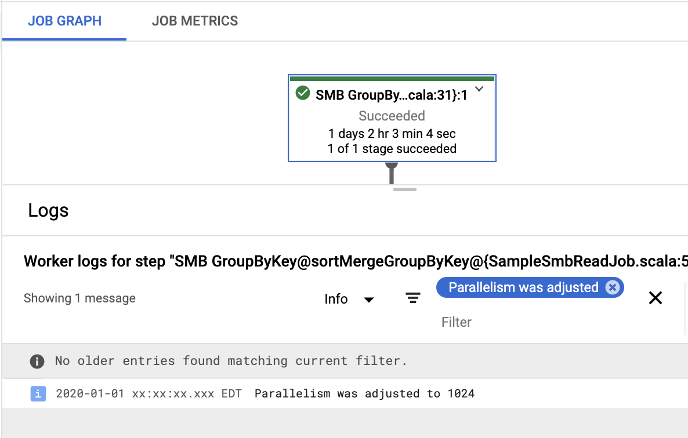

# Sort Merge Bucket

Sort Merge Bucket is a technique for writing data to file system in deterministic file locations,
sorted according to some pre-determined key, so that it can later be read in as key groups with
no shuffle required. Since each element is assigned a file destination (bucket) based on a hash
of its join key, we can use the same technique to cogroup multiple Sources as long as they're
written using the same key and hashing scheme.

For example, given these input records, and SMB write will first extract the key, assign the record
to a bucket, sort values within the bucket, and write these values to a corresponding file.

|        Input        |   Key   |   Bucket   |       File Assignment      |
|-------------------------------------------------------------------------|
| {key:"b", value: 1} |   "b"   |      0     | bucket-00000-of-00002.avro |
| {key:"b", value: 2} |   "b"   |      0     | bucket-00000-of-00002.avro |
| {key:"a", value: 3} |   "a"   |      1     | bucket-00001-of-00002.avro |

Two sources can be joined by opening file readers on corresponding buckets of eachT source and
merging key-groups as we go.

## What are SMB transforms?

`scio-smb` provides three @javadoc[PTransform](org.apache.beam.sdk.transforms.PTransform)s,
as well as corresponding Scala API bindings, for SMB operations:

- @javadoc[SortedBucketSink](org.apache.beam.sdk.extensions.smb.SortedBucketSink) writes data
to file system in SMB format.
    Scala APIs (see: @scaladoc[SortedBucketSCollection](com.spotify.scio.smb.syntax.SortedBucketSCollection)):

       * `SCollection[T: Coder]#saveAsSortedBucket`
    
    @@snip [SortMergeBucketExample.scala](/scio-examples/src/main/scala/com/spotify/scio/examples/extra/SortMergeBucketExample.scala) { #SortMergeBucketExample_sink }

    Note the use of `Integer` for parameterized key type instead of a Scala `Int`. The key class
    must have a Coder available in the default Beam (Java) coder registry.
    
    Also note that the number of buckets specified must be a power of 2. This allows sources of different
    bucket sizes to still be joinable.

- @javadoc[SortedBucketSource](org.apache.beam.sdk.extensions.smb.SortedBucketSource) reads
data that has been written to file system using `SortedBucketSink` into a collection of
@javadoc[CoGbkResult](org.apache.beam.sdk.transforms.join.CoGbkResult)s.
    Scala APIs (see: @scaladoc[SortedBucketScioContext](com.spotify.scio.smb.syntax.SortedBucketScioContext)):
      
      * `ScioContext#sortMergeGroupByKey` (1 source)
      * `ScioContext#sortMergeJoin` (2 sources)
      * `ScioContext#sortMergeCoGroup` (1-22 sources)
 
    Note that each @javadoc[TupleTag](org.apache.beam.sdk.values.TupleTag) used to create the @javadoc[SortedBucketIO.Read](org.apache.beam.sdk.extensions.smb.SortedBucketIO.Read)s needs to have a unique Id.

    @@snip [SortMergeBucketExample.scala](/scio-examples/src/main/scala/com/spotify/scio/examples/extra/SortMergeBucketExample.scala) { #SortMergeBucketExample_join }

- @javadoc[SortedBucketTransform](org.apache.beam.sdk.extensions.smb.SortedBucketTransform) reads
data that has been written to file system using `SortedBucketSink`, transforms each
@javadoc[CoGbkResult](org.apache.beam.sdk.transforms.join.CoGbkResult) using a user-supplied
function, and immediately rewrites them using the same bucketing scheme.
    Scala APIs (see: @scaladoc[SortedBucketScioContext](com.spotify.scio.smb.syntax.SortedBucketScioContext)):

      * `ScioContext#sortMergeTransform` (1-22 sources)
    
    Note that each @javadoc[TupleTag](org.apache.beam.sdk.values.TupleTag) used to create the @javadoc[SortedBucketIO.Read](org.apache.beam.sdk.extensions.smb.SortedBucketIO.Read)s needs to have a unique Id.
            
    @@snip [SortMergeBucketExample.scala](/scio-examples/src/main/scala/com/spotify/scio/examples/extra/SortMergeBucketExample.scala) { #SortMergeBucketExample_transform }

## What kind of data can I write using SMB?

SMB writes are supported for multiple formats:

- Avro (GenericRecord and SpecificRecord) when also depending on `scio-avro`.
  - @javadoc[AvroSortedBucketIO](org.apache.beam.sdk.extensions.smb.AvroSortedBucketIO)
- JSON
  - @javadoc[JsonSortedBucketIO](org.apache.beam.sdk.extensions.smb.JsonSortedBucketIO)
- Parquet when also depending on  `scio-parquet`
  - @javadoc[ParquetAvroSortedBucketIO](org.apache.beam.sdk.extensions.smb.ParquetAvroSortedBucketIO)
  - @javadoc[ParquetTypesSortedBucketIO](org.apache.beam.sdk.extensions.smb.ParquetTypesSortedBucketIO)
- Tensorflow when also depending on `scio-tensorflow`
  - @javadoc[TensorFlowBucketIO](org.apache.beam.sdk.extensions.smb.TensorFlowBucketIO)

## Null keys in SMB datasets

If the key field of one or more PCollection elements is null, those elements will be diverted into a special
bucket file, `bucket-null-keys.avro`. This file will be ignored in SMB reads and transforms and must
be manually read by a downstream user.

## Avro String keys

If you're using `AvroSortedBucketIO`, be aware of how Avro String fields are decoded. Configuration
errors can result in the following runtime exception:

```bash
Cause: java.lang.ClassCastException: class org.apache.avro.util.Utf8 cannot be cast to class java.lang.String
[info]   at org.apache.beam.sdk.coders.StringUtf8Coder.encode(StringUtf8Coder.java:37)
[info]   at org.apache.beam.sdk.extensions.smb.BucketMetadata.encodeKeyBytes(BucketMetadata.java:222)
```

### SpecificRecords

Scio 0.10.4 specifically has a bug in the default String decoding behavior for `SpecificRecords`: by default,
they're decoded at runtime into `org.apache.avro.util.Utf8` objects, rather than `java.lang.String`s
(the generated getter/setter signatures use `CharSequence` as an umbrella type). This bug has been fixed in
Scio 0.11+. If you cannot upgrade, you can mitigate this by ensuring your `SpecificRecord` schema has the property
`java-class: java.lang.String` set in the key field. This can be done either in the avsc/avdl schema or in
Java/Scala code:

```scala
val mySchema: org.apache.avro.Schema = ???
mySchema
  .getField("keyField")
  .schema()
  .addProp(
    org.apache.avro.specific.SpecificData.CLASS_PROP,
    "java.lang.String".asInstanceOf[Object]
  )
```

Note: If you're using [sbt-avro](https://github.com/sbt/sbt-avro#examples) for schema generation, you can
just set the SBT property `avroStringType := "String"` instead.

### GenericRecords

For GenericRecords, `org.apache.avro.util.Utf8` decoding has always been the default. If you're reading
Avro GenericRecords in your SMB join, set the `avro.java.string: String` property in the Schema of the key field.

```scala
val mySchema: org.apache.avro.Schema = ???
mySchema
  .getField("keyField")
  .schema()
  .addProp(
    org.apache.avro.generic.GenericData.STRING_PROP,
    "String".asInstanceOf[Object]
  )
```

## Parquet

SMB supports Parquet reads and writes in both Avro and case class formats.

If you're using Parquet-Avro and your schema contains a _logical type_, you'll have to opt in to a logical type _supplier_
in your Parquet `Configuration` parameter:

```scala mdoc:reset
import org.apache.avro.specific.SpecificRecordBase

import org.apache.beam.sdk.extensions.smb.{AvroLogicalTypeSupplier, ParquetAvroSortedBucketIO}
import org.apache.beam.sdk.values.TupleTag
import org.apache.hadoop.conf.Configuration
import org.apache.parquet.avro.{AvroDataSupplier, AvroReadSupport, AvroWriteSupport}
import com.spotify.scio.avro.TestRecord

// Reads
val readConf = new Configuration()
readConf.setClass(AvroReadSupport.AVRO_DATA_SUPPLIER, classOf[AvroLogicalTypeSupplier], classOf[AvroDataSupplier])

ParquetAvroSortedBucketIO
  .read[TestRecord](new TupleTag[TestRecord], classOf[TestRecord])
  .withConfiguration(readConf)

// Writes
val writeConf = new Configuration()
writeConf.setClass(AvroWriteSupport.AVRO_DATA_SUPPLIER, classOf[AvroLogicalTypeSupplier], classOf[AvroDataSupplier])

ParquetAvroSortedBucketIO
  .write(classOf[String], "myKeyField", classOf[TestRecord])
  .withConfiguration(writeConf)

// Transforms
val transformConf = new Configuration()
transformConf.setClass(AvroReadSupport.AVRO_DATA_SUPPLIER, classOf[AvroLogicalTypeSupplier], classOf[AvroDataSupplier])
transformConf.setClass(AvroWriteSupport.AVRO_DATA_SUPPLIER, classOf[AvroLogicalTypeSupplier], classOf[AvroDataSupplier])

ParquetAvroSortedBucketIO
  .transformOutput(classOf[String], "myKeyField", classOf[TestRecord])
  .withConfiguration(transformConf)
```

Note that if you're using a non-default Avro version (i.e. Avro 1.11), you'll have to supply a custom logical type supplier
using Avro 1.11 classes. See @ref:[Logical Types in Parquet](../io/Parquet.md#logical-types) for more information.

## Tuning parameters for SMB transforms

### numBuckets/numShards
SMB reads should be more performant and less resource-intensive than regular joins or groupBys.
However, SMB writes are more expensive than their regular counterparts, since they involve an extra
group-by (bucketing) and sorting step.  Additionally, non-SMB writes (i.e. implementations of
@javadoc[FileBasedSink](org.apache.beam.sdk.io.FileBasedSink)) use hints from the runner to determine
an optimal number of output files. Unfortunately, SMB doesn't have access to those runtime hints;
you must specify the number of buckets and shards as static values up front.

In SMB, *buckets* correspond to the hashed value of the SMB key % a given power of 2. A record with a given key will _always_ be hashed
into the same bucket. On the file system, buckets consist of one or more *sharded files* in which
records are randomly assigned per-bundle. Two records with the same key may end up in different shard files within a bucket.
 
- A good starting point is to look at your output data as it has been written by a non-SMB sink,
  and pick the closest power of 2 as your initial `numBuckets` and set `numShards` to 1.
- If you anticipate having hot keys, try increasing `numShards` to randomly split data within a bucket.
- `numBuckets` * `numShards` = total # of files written to disk.

### sorterMemoryMb
If your job gets stuck in the sorting phase (since the `GroupByKey` and `SortValues` transforms
  may get fused--you can reference the @javadoc[Counter](org.apache.beam.sdk.metrics.Counter)s
  `SortedBucketSink-bucketsInitiatedSorting` and `SortedBucketSink-bucketsCompletedSorting`
  to get an idea of where your job fails), you can increase sorter memory
  (default is 1024MB, or 128MB for Scio <= 0.9.0):

```scala
data.saveAsSortedBucket(
  AvroSortedBucketIO
    .write[K, V](classOf[K], "keyField", classOf[V])
    .to(...)
    .withSorterMemoryMb(256)
)
```

The amount of data each external sorter instance needs to handle is `total output size / numBuckets
/ numShards`, and when this exceeds sorter memory, the sorter will spill to disk. `n1-standard`
workers has 3.75GB RAM per CPU, so 1GB sorter memory is a decent default, especially if the output
files are kept under that size. If you have to spill to disk, note that worker disk IO depends on
disk type, size, and worker number of CPUs.

See [specifying pipeline execution
parameters](https://cloud.google.com/dataflow/docs/guides/specifying-exec-params) for more details,
e.g. `--workerMachineType`, `--workerDiskType`, and `--diskSizeGb`. Also read more about [machine
types](https://cloud.google.com/compute/docs/machine-types) and [block storage
performance](https://cloud.google.com/compute/docs/disks/performance)

### Parallelism
The `SortedBucketSource` API accepts an optional
@javadoc[TargetParallelism](org.apache.beam.sdk.extensions.smb.TargetParallelism) parameter to set the
desired parallelism of the SMB read operation. For a given set of sources, `targetParallelism` can be
set to any number between the least and greatest numbers of buckets among sources. This can be
dynamically configured using `TargetParallelism.min()` or `TargetParallelism.max()`, which at graph
construction time will determine the least or greatest amount of parallelism based on sources.

Alternately, `TargetParallelism.of(Integer value)` can be used to statically configure a custom value,
or `{@link TargetParallelism#auto()}` can be used to let the runner decide how to split the SMB read
at runtime based on the combined byte size of the inputs--this is also the default behavior if
`TargetPallelism` is left unspecified.

If no value is specified, SMB read operations will use Auto parallelism.

When selecting a target parallelism for your SMB operation, there are tradeoffs to consider:

  - Minimal parallelism means a fewer number of workers merging data from potentially many
    buckets. For example, if source A has 4 buckets and source B has 64, a minimally parallel
    SMB read would have 4 workers, each one merging 1 bucket from source A and 16 buckets from
    source B. This read may have low throughput.
  - Maximal parallelism means that each bucket is read by at least one worker. For example, if
    source A has 4 buckets and source B has 64, a maximally parallel SMB read would have 64 workers,
    each one merging 1 bucket from source B and 1 bucket from source A, replicated 16 times. This
    may have better throughput than the minimal example, but more expensive because every key group
    from the replicated sources must be re-hashed to avoid emitting duplicate records.
  - A custom parallelism in the middle of these bounds may be the best balance of speed and
    computing cost.
  - Auto parallelism is more likely to pick an ideal value for most use cases. If its performance is
    worse than expected, you can look up the parallelism value it has computed and try a manual adjustment.
    Unfortunately, since it's determined at runtime, the computed parallelism value can't be added
    to the pipeline graph through `DisplayData`. Instead, you'll have to check the worker logs to find
    out which value was selected. When using Dataflow, you can do this in the UI by clicking on the
    SMB transform box, and searching the associated logs for the text `Parallelism was adjusted`.
    For example, in this case the value is 1024:

    <div style="text-align: center;"></div>

    From there, you can try increasing or decreasing the parallelism by specifying a different
    `TargetParallelism` parameter to your SMB read. Often auto-parallelism will select a low value and
    using `TargetParallelism.max()` can help.

### Read buffering
Performance can suffer when reading an SMB source across many partitions if the total number of files
(`numBuckets` * `numShards` * `numPartitions`) is too large (on the order of hundreds of thousands to millions of files).
We've observed errors and timeouts as a result of too many simultaneous filesystem connections. To that end,
we've added two @javadoc[PipelineOptions](org.apache.beam.sdk.options.PipelineOptions) to Scio 0.10.3, settable either via command-line args
or using @javadoc[SortedBucketOptions](org.apache.beam.sdk.extensions.smb.SortedBucketOptions) directly.

  - `--sortedBucketReadBufferSize` (default: 10000): an Integer that determines the number of _elements_ to read and buffer
    from _each file_ at a time. For example, by default, each file will have 10,000 elements read and buffered into
    an in-memory array at worker startup. Then, the sort-merge algorithm will request them one at a time as needed. Once 10,000 elements
    have been requested, the file will buffer the next 10,000.

    *Note*: this can be quite memory-intensive and require bumping the worker memory. If you have a
    small number of files, or don't need this optimization, you can turn it off by setting `--sortedBucketReadBufferSize=0`.
  - `--sortedBucketReadDiskBufferMb` (default: unset): an Integer that, if set, will force each worker to
    actually copy the specified # of megabytes from the remote filesystem into the worker's local temp directory,
    rather than streaming directly from FS. This caching is done eagerly: each worker will read as much as it can of each file
    in the order they're requested, and more space will be freed up once a file is fully read. Note that this is
    a _per worker limit_.

## Testing
Currently, mocking data for SMB transforms is not supported in the `com.spotify.scio.testing.JobTest` framework. See
@github[SortMergeBucketExampleTest](/scio-examples/src/test/scala/com/spotify/scio/examples/extra/SortMergeBucketExampleTest.scala)
for an example of using local temp directories to test SMB reads and writes.
