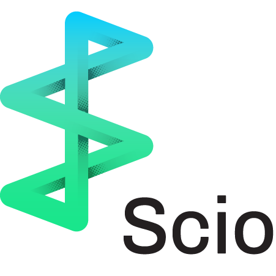

> Ecclesiastical Latin IPA: /ˈʃi.o/, [ˈʃiː.o], [ˈʃi.i̯o]  
> Verb: I can, know, understand, have knowledge.

# Scio 

Scio is a Scala API for [Apache Beam](https://beam.apache.org/) and [Google Cloud Dataflow](https://github.com/GoogleCloudPlatform/DataflowJavaSDK) inspired by [Apache Spark](https://spark.apache.org/) and [Scalding](https://github.com/twitter/scalding).

@ref:[Getting Started](Getting-Started.md) is the best place to start with Scio. If you are new to Apache Beam and distributed data processing, check out the [Beam Programming Guide](https://beam.apache.org/documentation/programming-guide/) first for a detailed explanation of the Beam programming model and concepts. If you have experience with other Scala data processing libraries, check out this comparison between [[Scio, Scalding and Spark]]. Finally check out this document about the relationship between [[Scio, Beam and Dataflow]].

Example Scio pipelines and tests can be found under @github[scio-examples](/scio-examples/src). A lot of them are direct ports from Beam's Java [examples](https://github.com/apache/beam/tree/master/examples). See this [page](https://spotify.github.io/scio/examples/) for some of them with side-by-side explanation. Also see [Big Data Rosetta Code](https://github.com/spotify/big-data-rosetta-code) for common data processing code snippets in Scio, Scalding and Spark.

See @scaladoc[Scio Scaladocs](com.spotify.scio.index)  for current API documentation.

See [scio-contrib](https://github.com/spotify/scio-contrib) for community-supported add-ons for Scio.

## Getting help
- 
- 
- 

## Documentation
- @ref:[Getting Started](Getting-Started.md) - current API documentation
- @ref:[Scio REPL](Scio-REPL.md) - tutorial for the interactive Scio REPL
- @ref:[Scio, Beam and Dataflow](Scio,-Beam-and-Dataflow.md) - how Scio concepts map to Beam and Dataflow
- @ref:[Scio, Scalding and Spark](Scio,-Scalding-and-Spark.md) - comparison of these frameworks
- @ref:[Runners](Runners.md) - how Scio handles Beam runners and runner specific logic
- @ref:[Scio data guideline](Scio-data-guideline.md) - guideline for common problems
- @ref:[Apache Beam](Apache-Beam.md) - notes on Apache Beam compatibility
- @ref:[Changelog](Changelog.md) - breaking changes in each release
- @ref:[FAQ](FAQ.md) - frequently asked questions
- @ref:[Powered By](Powered-By.md) - see who is using Scio in production

### IO
  - @ref:[Type safe BigQuery](io/Type-Safe-BigQuery.md) - tutorial for the type safe BigQuery API
  - @ref:[HDFS](io/HDFS.md) - using Scio with HDFS files
  - @ref:[Bigtable](io/Bigtable.md) - using Scio with Bigtable
  - @ref:[Avro](io/Avro.md) - using Scio with Avro files
  - @ref:[Protobuf](io/Protobuf.md) - using Scio with Protobuf
  - @ref:[Parquet](io/Parquet.md) - using Scio with Parquet files
  
### Extras
  - @ref:[Algebird](extras/Algebird.md)
  
### Internals
  - @ref:[ScioIO](internals/ScioIO.md) - new IO system to simplify implementation and stubbing in `JobTest`
  - @ref:[OverrideTypeProvider](internals/OverrideTypeProvider.md) - custom mappings for type-safe BigQuery
  - @ref:[Kryo](internals/Kryo.md) - [Kryo](https://github.com/EsotericSoftware/kryo) data serialization
  - @ref:[Coders](internals/Coders.md) - new [Magnolia](https://github.com/propensive/magnolia) based Coders derivation

## Further Readings
  - [Big Data Processing at Spotify: The Road to Scio (Part 1)](https://labs.spotify.com/2017/10/16/big-data-processing-at-spotify-the-road-to-scio-part-1/)
  - [Big Data Processing at Spotify: The Road to Scio (Part 2)](https://labs.spotify.com/2017/10/23/big-data-processing-at-spotify-the-road-to-scio-part-2/)
  - [The world beyond batch: Streaming 101](https://www.oreilly.com/ideas/the-world-beyond-batch-streaming-101)
  - [The world beyond batch: Streaming 102](https://www.oreilly.com/ideas/the-world-beyond-batch-streaming-102)
  - [Dataflow/Beam & Spark: A Programming Model Comparison](https://cloud.google.com/dataflow/blog/dataflow-beam-and-spark-comparison)
  - [VLDB paper](http://www.vldb.org/pvldb/vol8/p1792-Akidau.pdf) on the Dataflow Model

## Presentations
  - [Scio - Big Data on Google Cloud with Scala and Scio](https://docs.google.com/presentation/d/1F02Lwnqm9H3cGqDQhIZ3gbftyLQSnVMRxX69H_d04OE/edit#slide=id.p4) - Apache Beam Summit London 2018 Talk
  - [Sorry - How Bieber broke Google Cloud at Spotify](https://www.youtube.com/watch?v=1dchSsac3T4) ([slides](https://www.slideshare.net/sinisalyh/sorry-how-bieber-broke-google-cloud-at-spotify)) - Scala Up North 2017 Talk
  - [Scio - Moving to Google Cloud A Spotify Story](https://www.infoq.com/presentations/scio) ([slides](https://www.slideshare.net/sinisalyh/scio-moving-to-google-cloud-a-spotify-story)) - Philly ETE 2017 Talk
  - [Scio - A Scala API for Google Cloud Dataflow & Apache Beam](https://www.youtube.com/watch?v=4wDwVgODyAg) ([slides](https://www.slideshare.net/sinisalyh/scio-a-scala-api-for-google-cloud-dataflow-apache-beam)) - Scala by the Bay 2016 Talk
  - [From stream to recommendation with Cloud Pub/Sub and Cloud Dataflow](https://www.youtube.com/watch?v=xT6tQAIywFQ) - GCP NEXT 16 Talk
  - [Apache Beam Presentation Materials](https://beam.apache.org/contribute/presentation-materials/)

## Projects using or related to Scio
  - [scio-contrib](https://github.com/spotify/scio-contrib) - Community-supported add-ons for Scio
  - [Featran](https://github.com/spotify/featran) - A Scala feature transformation library for data science and machine learning
  - [Big Data Rosetta Code](https://github.com/spotify/big-data-rosetta-code) - Code snippets for solving common big data problems in various platforms. Inspired by [Rosetta Code](https://rosettacode.org/)
  - [Ratatool](https://github.com/spotify/ratatool) - A tool for random data sampling and generation, which includes [BigDiffy](https://github.com/spotify/ratatool/blob/master/ratatool-diffy/src/main/scala/com/spotify/ratatool/diffy/BigDiffy.scala), a Scio library for pairwise field-level statistical diff of data sets ([slides](http://www.lyh.me/slides/bigdiffy.html))
  - [scio-deep-dive](https://github.com/nevillelyh/scio-deep-dive) - Building Scio from scratch step by step for an internal training session
  - [scala-flow](https://github.com/zendesk/scala-flow) - A lightweight Scala wrapper for Google Cloud Dataflow from Zendesk
  - [clj-headlights](https://github.com/zendesk/clj-headlights) - Clojure API for Apache Beam, also from Zendesk
  - [datasplash](https://github.com/ngrunwald/datasplash) - A Clojure API for Google Cloud Dataflow

@@@ index

* [Getting Started](Getting-Started.md)
* [Examples](examples.md)
* [IO](io/index.md)
* [Testing](Scio-Unit-Tests.md)
* [REPL](Scio-REPL.md)
* [Internals](internals/index.md)
* [Extras](extras/index.md)
* [Migration guides](migrations/index.md)
* [Development](dev/index.md)
* [Scaladoc](scaladoc.md)
* [Scio, Beam and Dataflow](Scio,-Beam-and-Dataflow.md)
* [Scio, Scalding and Spark](Scio,-Scalding-and-Spark.md)
* [Runners](Runners.md)
* [Data guideline](Scio-data-guideline.md)
* [Versions](Apache-Beam.md)
* [Changelog](Changelog.md)
* [FAQ](FAQ.md)
* [Powered By](Powered-By.md)
  
@@@
